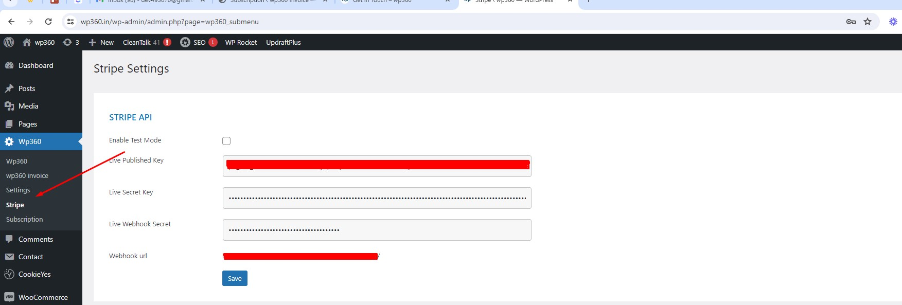
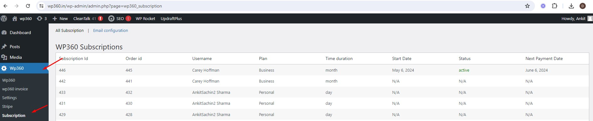

=== WP360 SUBSCRIPTION ===

Contributors: wp360
Donate link: https://wp360.in
Tags: Payment, Recurring Payment, Subscription
Requires at least: 5.2.0
Tested up to: 6.3
Stable tag: 6.1.6
Requires PHP: 7.4.8
License: GPLv2 or later
License URI: https://www.gnu.org/licenses/gpl-2.0.html

## Description

WP360 SUBSCRIPTION is a plugin designed as a subscription addon for the WP360 suite. It facilitates both one-time (standard) and recurring (subscription) payment features within the WP360 suite environment.

## Features

- Enables one-time (standard) and recurring (subscription) payment options.
- Compatible with WooCommerce.
- Provides essential functions for subscription management.

## Installation

1. Download the plugin files and extract them into your `wp-content/plugins/` directory, or install the plugin directly from the WordPress admin panel.
2. Activate the WP360 SUBSCRIPTION plugin through the 'Plugins' menu in WordPress.
3. Make sure your WordPress version is at least 5.2.0 and PHP version is at least 7.3.

## Usage

Once activated, the WP360 SUBSCRIPTION plugin extends the functionality of your WP360 suite by integrating subscription-based payment options. Configure the plugin settings and manage subscriptions through the WP360 suite interface.

== Screenshots ==

1. This screen shot description corresponds to screenshot-1.(png|jpg|jpeg|gif). Screenshots are stored in the /screenshots directory.
2. This is the second screen shot

*Add Invoice form in the WordPress admin.*

*List of invoices in the WordPress admin.*

== Upgrade Notice ==

= 1.1.0

Initial release of the WP360 Invoice Plugin.

Blockquotes are email style:

> Asterisks for *emphasis*. Double it up  for **strong**.

And Backticks for code:

`<?php code(); ?>`

## Contribution

Contributions are welcome! If you find any issues or have suggestions for improvements, please open an issue or submit a pull request on the [GitHub repository](https://github.com/wp360-in/wp360-subscription).

## Support

For support, please visit the [WP360 Support Forum](https://wp360.in/contact/) or contact us through [wp360.in](https://wp360.in/).

## License

This project is licensed under the [GNU General Public License v3.0](https://www.gnu.org/licenses/gpl-3.0.en.html) - see the [LICENSE.md](LICENSE.md) file for details.

## Author

WP360 SUBSCRIPTION plugin is developed and maintained by [wp360](https://wp360.in/).
